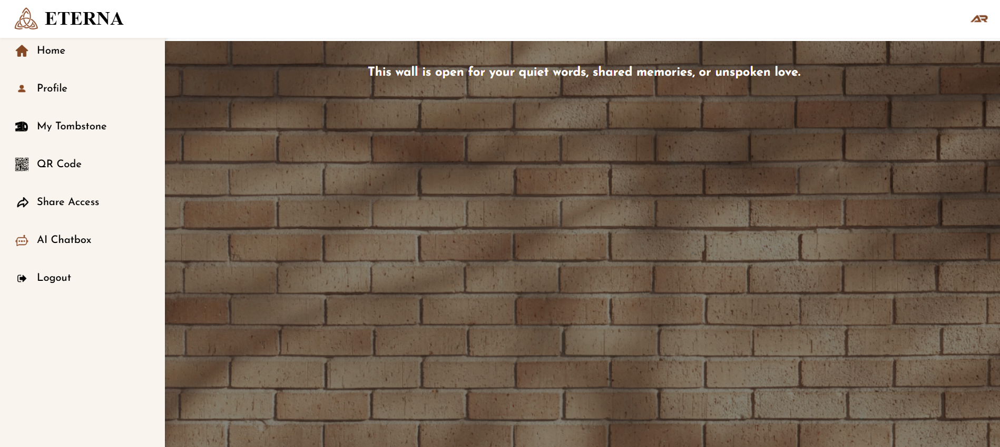
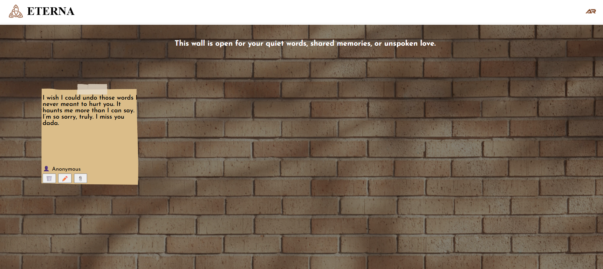
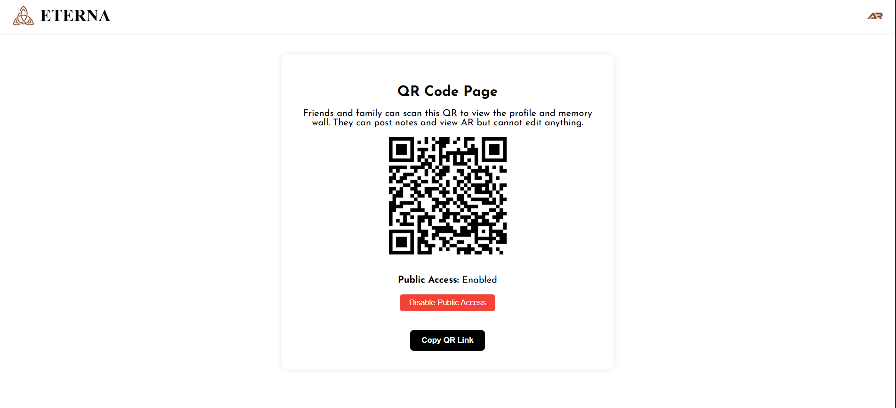
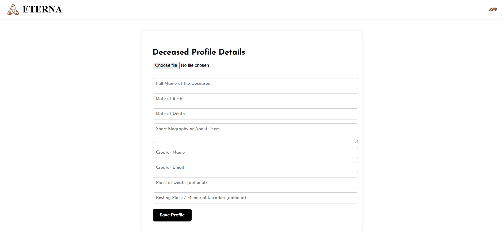
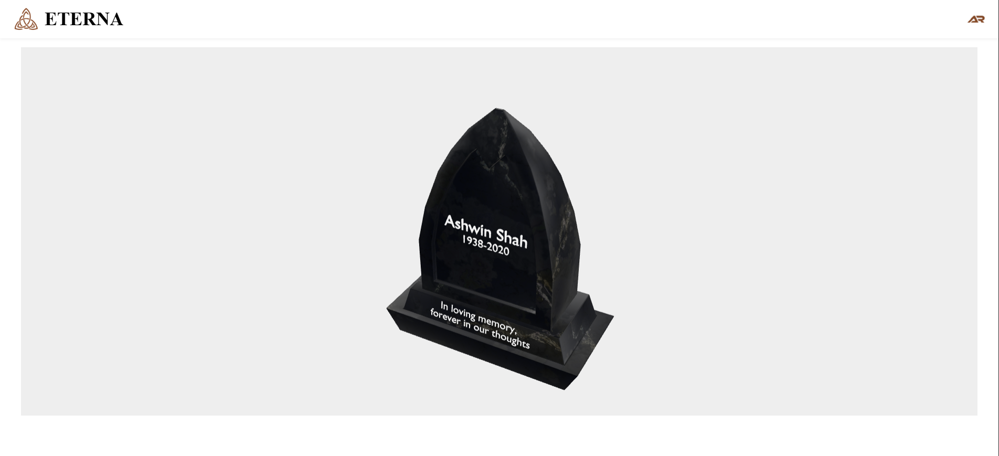
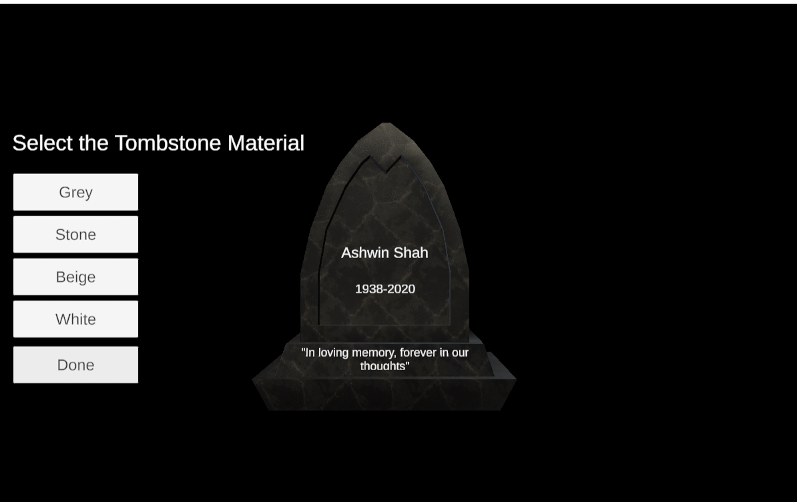

# Eterna

A digital memorial platform — create a shareable memorial page, customize a 3D tombstone, and view it in AR.

## What it is

Eterna lets someone create a lasting digital memorial for a loved one: a profile with their story, a "memory wall" where family and friends can leave photos and messages, and a custom 3D tombstone that visitors can view in augmented reality by scanning a QR code. It's a full-stack project spanning a React web app, a Firebase backend, and a standalone Unity 3D tombstone customizer.

## What it does

- **Create a memorial profile** — name, dates, place, bio, and a cover photo.
- **Memory wall** — visitors add photos and messages to a shared, real-time wall of tributes.
- **3D tombstone customization** — a Unity-built configurator for choosing tombstone shape, material, and inscription.
- **AR viewing** — the finished tombstone can be viewed in augmented reality on a visitor's phone via `<model-viewer>` (scene-viewer / WebXR / Quick Look).
- **QR code sharing** — every memorial gets a QR code for easy, low-friction access at a physical location (e.g. a gravesite or memorial event).
- **Auth & access control** — Firebase Authentication gates who can create and edit a memorial.

## Tech stack

- **Web frontend:** React 19, React Router
- **Backend:** Firebase (Authentication, Firestore, Storage)
- **Image hosting:** Cloudinary
- **AR viewer:** Google `<model-viewer>`
- **3D tombstone customizer:** Unity (WebGL build), C#
- **Other:** QR code generation (`qrcode.react`)

## Project structure

```
eterna-digital-memorial/
├── web/     — React + Firebase web app
└── unity/   — Unity project for the 3D tombstone customizer (WebGL build)
```

## Running it locally

**Web app:**
```bash
cd web
npm install
npm start
```
You'll need your own Firebase project config in `web/src/firebaseConfig.js` and a Cloudinary account for image uploads.

**Unity project:** open `unity/` in Unity Hub (see `unity/ProjectSettings/ProjectVersion.txt` for the exact editor version) and build for WebGL.

## Screenshots

<table>
<tr>
<td><br/><sub>Memory wall</sub></td>
<td><br/><sub>A shared memory note</sub></td>
<td><br/><sub>QR code sharing</sub></td>
</tr>
<tr>
<td><br/><sub>Memorial profile creation</sub></td>
<td><br/><sub>3D tombstone AR viewer</sub></td>
<td><br/><sub>Tombstone customizer (Unity)</sub></td>
</tr>
</table>
